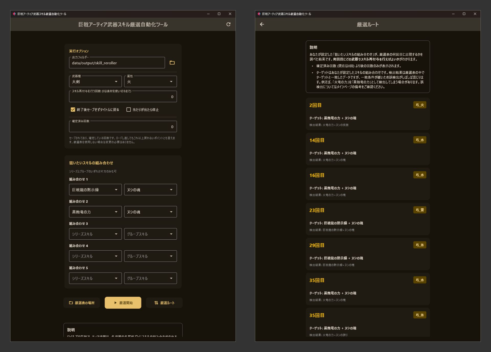
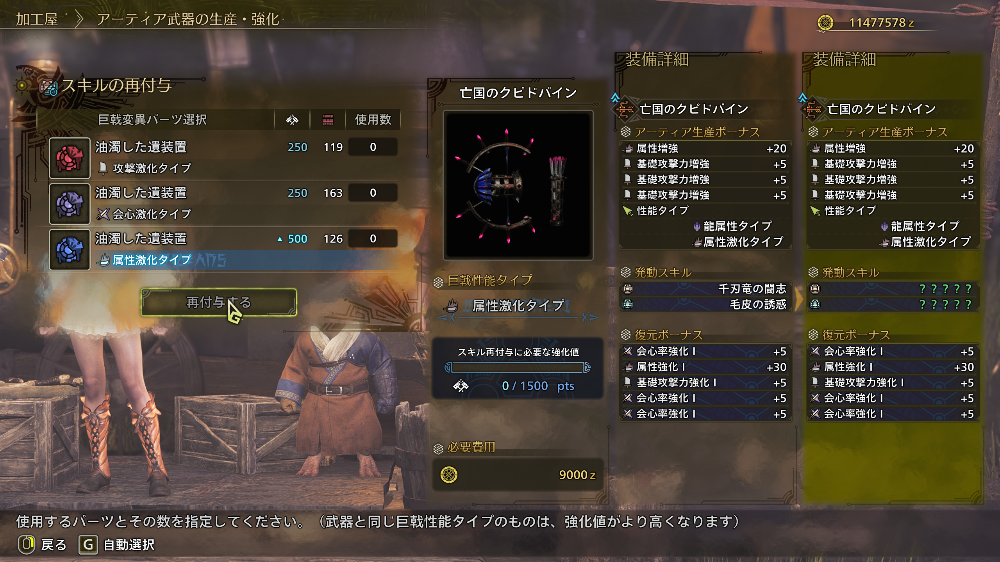

# README

Monster Hunter Wilds の巨戟アーティア武器の厳選作業を自動化するツールのリポジトリです。現在はスキル再付与を自動化し当たりを探したり厳選表の自動作成を行うツールがあります。

## スキル厳選自動化ツール

- **ワイルズのスキル厳選の仕様を理解した上で利用してください。**
- **チートではないですが、いわゆるマクロなので自己責任で利用してください。**マクロがピンとこない方は、コントローラーの背面ボタンに特定のコンボ操作を割り当てるのと似たようなものと理解してください。

### 起動方法

1.  Release から Source code ではない zip ファイルをダウンロードして解凍してください。
2.  解凍したフォルダー内の`scripts`フォルダーにある `run_skill_reroller.bat` をダブルクリックして実行してください。初回起動時は必要なファイルのダウンロードとセットアップが行われるため、黒い画面が表示され、起動まで少し時間がかかります。2 回目以降はすぐに起動します。

### 基本的な使い方

**より詳しい説明がツール内に表示されます。**

1. **ゲーム画面の準備**

- ゲームをウィンドウモードまたはウィンドウフルスクリーンモードに設定してください。
- 巨戟アーティア武器の「スキル再付与」画面を表示した状態にしてください。下の画像の画面です。

  

2. **ツールの設定**

ここでは基本的な設定について説明します。

- **出力フォルダー**: スクリーンショットや厳選表 (`reroll_table.csv`) の保存先を指定します。
- **武器種と属性**: スキル厳選を行う武器種と属性を選択してください。
- **狙いたいスキルの組み合わせ**: 欲しいスキルの組み合わせを最大 5 つ設定します。

3. **実行**

設定が完了したら、「厳選開始」ボタンを押してください。自動操作が始まります。実行中は他のウィンドウに切り替えたり余計なキーを押下しないでください。

4. **結果の確認**

   - 出たスキルの履歴等のレポートと、当たりと引いたときのスクリーンショットが`出力フォルダー/タイムスタンプ`に保存されます。
   - 厳選表 (`出力フォルダー/reroll_table.csv`) が作成あるいは更新され、各武器各属性で、何回目にどのスキルが出たかが記録されます。
   - 「厳選ルート」ボタンから、記録されたデータを元に最短ルートを確認できます。
